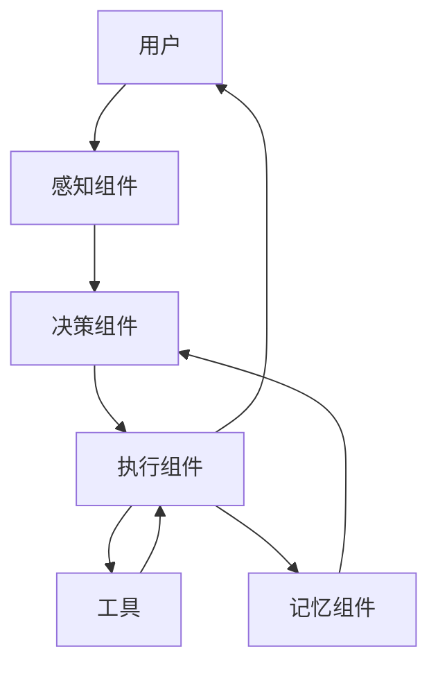

# Agent架构设计

## 概览
Agent架构设计章节用于设计产品的Agent架构，明确Agent的组件、交互流程、数据流向等。

---

## 核心内容

### Agent组件
- **感知组件**：感知环境和用户输入
- **决策组件**：做出决策和规划
- **执行组件**：执行决策和调用工具
- **记忆组件**：存储和管理记忆
- **学习组件**：从经验中学习

### 交互流程
- **用户输入**：用户输入请求
- **感知**：Agent感知用户输入
- **决策**：Agent做出决策
- **执行**：Agent执行决策
- **输出**：Agent输出结果

### 数据流向
- **用户 → Agent**：用户输入传递给Agent
- **Agent → 工具**：Agent调用工具
- **工具 → Agent**：工具返回结果
- **Agent → 用户**：Agent返回结果给用户

---

## 填充指南

### 步骤1：设计Agent组件
- 根据Agent能力评估结果，设计Agent组件
- 明确每个组件的功能和职责
- 明确每个组件的输入和输出

### 步骤2：设计交互流程
- 设计Agent的交互流程
- 明确每个流程的输入和输出
- 明确每个流程的异常处理

### 步骤3：设计数据流向
- 设计Agent的数据流向
- 明确数据的传递方式
- 明确数据的存储方式

### 步骤4：输出Agent架构设计结果
- 汇总Agent架构设计结果
- 生成Agent架构设计文档

---

## 示例

### Agent架构图

### 组件说明
- **感知组件**：感知用户输入，解析用户意图
- **决策组件**：根据感知结果，做出决策和规划
- **执行组件**：执行决策，调用工具
- **记忆组件**：存储和管理记忆
- **工具**：外部工具，如数据库、API等

---

## 注意事项
- Agent架构设计应基于产品实际需求
- Agent架构设计应考虑可扩展性
- Agent架构设计应考虑容错性
- Agent架构设计应定期评估和调整
