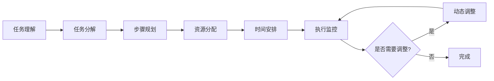

# 规划能力

## 概览
规划能力章节用于设计产品的规划能力，明确规划的类型、规划流程、规划优化等。

---

## 核心内容

### 规划类型
- **任务分解**：将复杂任务分解为子任务
- **步骤规划**：规划任务的执行步骤
- **资源规划**：规划任务所需的资源
- **时间规划**：规划任务的时间安排

### 规划流程
- **任务理解**：理解任务的目标和约束
- **任务分解**：将任务分解为子任务
- **步骤规划**：规划每个子任务的执行步骤
- **资源分配**：分配任务所需的资源
- **时间安排**：安排任务的时间
- **执行监控**：监控任务的执行进度
- **动态调整**：根据执行情况动态调整规划

### 规划优化
- **规划质量优化**：提高规划的质量
- **规划效率优化**：提高规划的效率
- **规划适应性优化**：提高规划的适应性

---

## 填充指南

### 步骤1：识别规划类型
- 根据产品需求，识别需要的规划类型
- 明确每种规划类型的功能和用途

### 步骤2：设计规划流程
- 设计任务理解的逻辑
- 设计任务分解的逻辑
- 设计步骤规划的逻辑
- 设计资源分配的逻辑
- 设计时间安排的逻辑
- 设计执行监控的逻辑
- 设计动态调整的逻辑

### 步骤3：设计规划优化
- 设计规划质量优化的方法
- 设计规划效率优化的方法
- 设计规划适应性优化的方法

### 步骤4：输出规划能力设计结果
- 汇总规划能力设计结果
- 生成规划能力设计文档

---

## 示例

### 规划流程图

### 任务分解示例
**原始任务**：帮我写一份市场分析报告
**分解后的子任务**：
1. 收集市场数据
2. 分析市场趋势
3. 分析竞争对手
4. 总结分析结果
5. 撰写报告

### 步骤规划示例
**子任务1：收集市场数据**
- 步骤1：查询行业数据库
- 步骤2：查询公开数据
- 步骤3：整理数据

---

## 注意事项
- 规划能力设计应基于产品实际需求
- 规划能力设计应考虑复杂任务
- 规划能力设计应考虑动态调整
- 规划能力设计应定期评估和调整
